# Design Playground

> 디자이너가 실제 렌더링된 UI 위에서 AI 에이전트와 대화하며 코드를 수정하고, PR로 제출하는 웹 서비스

## Problem

개발자가 Figma → 코드 전환을 완료하고 `dev` 브랜치에 머지한 이후, 디자이너의 세부 조정 요청은 항상 개발자를 거쳐야 한다. 간격 4px 변경, 색상 미세 조정 같은 사소한 수정도 커뮤니케이션 → 개발자 작업 → 확인 루프를 반복한다.

**Design Playground**는 이 루프를 제거한다. 디자이너가 직접 화면 위에서 컴포넌트를 선택하고, 자연어로 수정을 지시하면, AI 에이전트가 코드를 변경하고 PR을 생성한다. 개발자는 PR 리뷰만 하면 된다.

## User Flow

```mermaid
sequenceDiagram
    participant D as Designer
    participant W as Web Service
    participant A as AI Agent
    participant G as GitHub

    D->>W: GitHub OAuth 로그인
    D->>W: 프로젝트 선택 + "새 세션 시작"
    W->>W: dev 브랜치 기반 worktree 생성
    W->>W: dev server 실행 + 오버레이 주입
    W-->>D: 프리뷰 URL 제공

    loop 수정 작업
        D->>W: 컴포넌트 클릭 + 수정 요청
        W->>A: 컴포넌트 컨텍스트 + 메시지 전달
        A->>W: 코드 변경 (worktree 내)
        W-->>D: hot-reload로 즉시 반영
    end

    D->>W: "PR 제출"
    W->>G: design/{user}-{id} 브랜치 push
    W->>G: PR 생성 (base: dev)
    W-->>D: PR URL 반환
    W->>W: 세션 정리 (worktree 삭제)
```



## Architecture


## Core Components

### Auth

- GitHub OAuth 로그인
- OAuth token 암호화 저장 (AES-256)
- repo 접근 권한 확인
- 역할: `designer` / `developer` / `admin`

### Project Registry

프로젝트(대상 repo)를 등록하고, 세션 생성 시 필요한 설정을 관리한다.

```yaml
project:
  name: "my-web-app"
  repo: "brandazine/my-web-app"
  base_branch: "dev"
  pr_target: "dev"

  dev_server:
    install: "pnpm install"
    start: "pnpm dev"
    port: 3000
    ready_check: "http://localhost:{port}"
    env_file: ".env.development"

  overlay:
    framework: "react"  # react | vue | svelte | html

  agent:
    model: "claude-sonnet-4-6"
    context_files:
      - "CLAUDE.md"
      - "src/styles/tokens.css"
    rules:
      - "디자인 토큰(CSS Custom Properties)을 우선 사용할 것"
      - "하드코딩된 색상/간격 값 사용 금지"
      - "기존 컴포넌트 API(props)를 변경하지 말 것"
```

### Session Manager

세션 = worktree + dev server + 에이전트 컨텍스트. 전체 생명주기를 관리한다.

**생명주기:**

| 단계 | 동작 |
|---|---|
| **생성** | `git fetch origin dev` → worktree 생성 (`design/{user}-{id}` 브랜치) → 의존성 설치 → dev server 시작 (동적 포트 할당) → ready check 대기 |
| **작업** | 에이전트가 worktree 내 파일 수정 → dev server hot-reload → 변경마다 자동 커밋 |
| **제출** | push → PR 생성 (base: dev) → 변경 전/후 스크린샷 첨부 |
| **정리** | dev server 종료 → worktree 삭제 → 메타데이터 archived |

**자동 정리:** 2시간 무활동 또는 24시간 초과 시 자동 정리. 최대 동시 세션 수 설정 가능 (기본 10).

**Dev Server 프록시:**

```
GET /session/{id}/preview/*
  → reverse proxy → localhost:{할당된 포트}
  → 응답 </body> 앞에 오버레이 스크립트 삽입
```

### Browser Overlay

프리뷰 페이지 위에 삽입되는 클라이언트 스크립트. 두 가지 기능을 제공한다.

**컴포넌트 인스펙터:**
- 빌드 시 Babel 플러그인으로 `data-source-file`, `data-source-line` 속성 주입
- hover → 컴포넌트 경계 하이라이트
- 클릭 → 파일 경로, 컴포넌트 이름, props, 적용된 CSS 변수 표시

**채팅 패널:**
- 선택된 컴포넌트를 자동으로 에이전트 컨텍스트에 포함
- 스트리밍 응답, 변경 diff 표시
- "적용" (hot-reload) / "되돌리기" (git checkout) / "PR 제출"

### Agent Service

디자이너의 자연어 요청을 코드 변경으로 변환한다.

**컨텍스트 조립:**
1. 선택된 컴포넌트 파일 내용
2. 관련 스타일/토큰 파일
3. 프로젝트 에이전트 규칙 (`agent.rules`)
4. 이전 대화 히스토리

**Agent Tools:**

| Tool | 설명 |
|---|---|
| `read_file` | worktree 내 파일 읽기 |
| `write_file` | worktree 내 파일 쓰기 (자동 커밋) |
| `list_files` | glob 패턴으로 파일 검색 |
| `search_code` | ripgrep 기반 코드 검색 |
| `get_design_tokens` | 프로젝트 디자인 토큰 목록 |
| `take_screenshot` | 현재 페이지 스크린샷 (Puppeteer) |
| `git_diff` | 현재 변경사항 diff |
| `git_undo` | 마지막 변경 되돌리기 |

## Data Models

```typescript
interface Project {
  id: string
  name: string
  repoFullName: string           // "org/repo-name"
  baseBranch: string
  prTargetBranch: string
  devServerConfig: {
    installCommand: string
    startCommand: string
    port: number
    readyCheck: string
    envFile: string | null
  }
  overlayConfig: {
    framework: 'react' | 'vue' | 'svelte' | 'html'
  }
  agentConfig: {
    model: string
    contextFiles: string[]
    rules: string[]
  }
}

interface Session {
  id: string
  userId: string
  projectId: string
  status: 'creating' | 'active' | 'submitting' | 'archived' | 'error'
  worktreePath: string
  branch: string
  devServerPort: number
  devServerPid: number | null
  createdAt: Date
  lastActiveAt: Date
  expiresAt: Date
  componentsTouched: string[]
  commitCount: number
  prUrl: string | null
}

interface ChatMessage {
  id: string
  sessionId: string
  role: 'user' | 'assistant'
  content: string
  componentContext: {
    filePath: string
    componentName: string
    props: Record<string, unknown>
  } | null
  changes: {
    filePath: string
    diff: string
    type: 'modified' | 'created' | 'deleted'
  }[] | null
  timestamp: Date
}
```

## API

### Auth
| Method | Path | 설명 |
|---|---|---|
| GET | `/auth/github` | OAuth 시작 |
| GET | `/auth/github/callback` | OAuth 콜백 |
| GET | `/auth/me` | 현재 사용자 |
| POST | `/auth/logout` | 로그아웃 |

### Projects
| Method | Path | 설명 |
|---|---|---|
| GET | `/api/projects` | 목록 |
| POST | `/api/projects` | 등록 |
| GET | `/api/projects/:id` | 상세 |
| PUT | `/api/projects/:id` | 수정 |
| DELETE | `/api/projects/:id` | 삭제 |

### Sessions
| Method | Path | 설명 |
|---|---|---|
| POST | `/api/sessions` | 생성 (worktree + dev server) |
| GET | `/api/sessions` | 내 세션 목록 |
| GET | `/api/sessions/:id` | 상세 |
| DELETE | `/api/sessions/:id` | 삭제 (정리) |
| POST | `/api/sessions/:id/submit` | PR 생성 |
| GET | `/api/sessions/:id/diff` | 변경사항 |
| POST | `/api/sessions/:id/undo` | 되돌리기 |

### Chat
| Method | Path | 설명 |
|---|---|---|
| POST | `/api/sessions/:id/chat` | 메시지 전송 (SSE 스트리밍) |
| GET | `/api/sessions/:id/chat/history` | 히스토리 |

### Preview
| Method | Path | 설명 |
|---|---|---|
| GET | `/session/:id/preview/*` | dev server 프록시 (오버레이 주입) |

## Tech Stack

| 레이어 | 기술 | 이유 |
|---|---|---|
| Backend | Node.js (Fastify) | child_process, 스트리밍 |
| Frontend | React + Vite | 대시보드 UI |
| Overlay | Vanilla JS + Preact | 번들 최소화, 프레임워크 충돌 방지 |
| DB | SQLite (better-sqlite3) | 단일 서버, 외부 의존성 없음 |
| AI | Claude API (Anthropic SDK) | tool use, 코드 생성 품질 |
| Git | simple-git | worktree, branch, commit |
| GitHub | Octokit | PR 생성, repo 접근 |
| Proxy | http-proxy | dev server 리버스 프록시 |
| Screenshot | Puppeteer | 변경 전/후 비교 |

## Project Structure

```
design-playground/
├── SPEC.md
├── package.json
├── tsconfig.json
├── .env.example
├── src/
│   ├── server/
│   │   ├── index.ts
│   │   ├── auth/
│   │   ├── projects/
│   │   ├── sessions/
│   │   │   ├── routes.ts
│   │   │   ├── service.ts
│   │   │   ├── worktree.ts
│   │   │   ├── dev-server.ts
│   │   │   └── cleanup.ts
│   │   ├── agent/
│   │   │   ├── routes.ts
│   │   │   ├── service.ts
│   │   │   ├── tools.ts
│   │   │   └── context.ts
│   │   ├── proxy/
│   │   │   ├── preview.ts
│   │   │   └── overlay-inject.ts
│   │   └── db/
│   ├── dashboard/
│   │   ├── App.tsx
│   │   ├── pages/
│   │   │   ├── Login.tsx
│   │   │   ├── Projects.tsx
│   │   │   └── Session.tsx
│   │   └── components/
│   │       ├── ChatPanel.tsx
│   │       ├── DiffViewer.tsx
│   │       └── ComponentInfo.tsx
│   └── overlay/
│       ├── index.ts
│       ├── inspector.ts
│       ├── highlighter.ts
│       ├── bridge.ts
│       └── ui.ts
└── data/                       # .gitignore, 런타임
    ├── repos/                  # bare clone
    └── sessions/               # worktree
```

## Environment Variables

```bash
# Server
PORT=4000
BASE_URL=http://localhost:4000

# GitHub OAuth
GITHUB_CLIENT_ID=
GITHUB_CLIENT_SECRET=

# Claude API
ANTHROPIC_API_KEY=

# Session
SESSION_SECRET=
MAX_CONCURRENT_SESSIONS=10
SESSION_TIMEOUT_HOURS=2
SESSION_MAX_LIFETIME_HOURS=24

# File System
DATA_DIR=/data

# Dev Server Port Range
DEV_SERVER_PORT_START=3001
DEV_SERVER_PORT_END=3100
```

## Security

- OAuth token AES-256 암호화 저장
- 에이전트 파일 접근 → worktree 디렉토리 내로 제한 (path traversal 차단)
- dev server → localhost 바인딩, 외부 직접 접근 불가
- 프리뷰 URL → 인증된 사용자만 접근
- 에이전트 채팅 → 분당 30회 rate limit

## Future

- **컨테이너화**: 세션별 Docker 격리 (보안 강화, 멀티 서버 확장)
- **Figma 연동**: Figma MCP로 디자인 변경 감지 → 자동 세션 생성
- **비교 뷰**: dev 원본 vs 수정본 side-by-side
- **디자인 토큰 탐색기**: 프로젝트 토큰을 시각적으로 브라우징/수정
- **팀 세션**: 여러 디자이너가 같은 세션에서 협업
